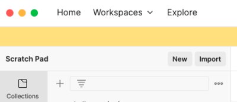

# Phase-4-Code-Challenge-Superheroes---Compulsory

# DC Superheroes

## Overview

This project **DC Superheroes** is a RESTful API built using **Flask** and **Flask-SQLAlchemy** to manage the data of  superheroes, their powers, and the relationships between them. It allows users to fetch hero and power data, update power descriptions, and create relationships between heroes and powers with defined strength levels.

---

## Features Include

- Retrieve a list of superheroes
- Get details of a specific hero
- Retrieve a list of superpowers
- Get details of a specific power
- Update a power description
- Assign a power to a hero with a strength level

---

## Technologies Used

- **Python** (Flask, Flask-SQLAlchemy, Flask-Migrate)
- **SQLite** (for database management)
- **Postman or curl** (for API testing)

---

## Setup & Installation

### **1 Clone the Repository**

```sh
 git clone git@github.com:louis479/Phase-4-Code-Challenge-Superheroes---Compulsory.git

 cd DC superheroes
```

### **2 Create and Activate a Virtual Environment**

- Ensure you first create and activate your python environment.

```sh
# For macOS/Linux
python3 -m venv venv
source venv/bin/activate

# For Windows
python -m venv venv
venv\Scripts\activate
```

### **3 Install Dependencies**

- Install Dependencies such as :

a). SQLAlchemy

```sh
pip install sqlalchemy

```

b.  Flask-Migrate

```sh
pip install flask-migrate
```

c. Flask & flask_marshmallow marshmallow-sqlalchemy

```sh
pip install flask flask_marshmallow marshmallow-sqlalchemy 
```

### **3 Set Up Database Migrations**

```sh
flask db init  
flask db migrate -m "Initial migration"
flask db upgrade
```

### **5 Run the Flask App**

```sh
flask run
```

By default, the app runs on `http://127.0.0.1:5000/`
---

## **6. Open your Postman**

- As you open your Postman ensure that you have downloaded your Postman collection(<https://moringa.instructure.com/courses/955/files/519112?wrap=1>) and import it to gain a better understanding on what to do



---

## API Endpoints

### **Base Endpoint**

- **GET /** → Returns a welcome message

### **Heroes**

- **GET /heroes** → Get a list of all heroes
- **GET /heroes/<id>** → Get a specific hero by ID

### **Powers**

- **GET /powers** → Get a list of all powers
- **GET /powers/<id>** → Get a specific power by ID
- **PATCH /powers/<id>** → Update a power's description (requires `description` field with at least 20 characters)

### **Hero Powers (Assigning Strength to a Hero’s Power)**

- **POST /hero_powers** → Assign a power to a hero with a strength level (Requires `hero_id`, `power_id`, and `strength` with values "Strong", "Weak", or "Average")

---

## Example Requests & Responses

### **1 Get All Heroes**

#### Request

```sh
GET /heroes
```

#### Response

```json
[
  {
    "id": 1,
    "name": "Kamala Khan",
    "super_name": "Ms. Marvel"
  },
  {
    "id": 2,
    "name": "Doreen Green",
    "super_name": "Squirrel Girl"
  },
  {
    "id": 3,
    "name": "Gwen Stacy",
    "super_name": "Spider-Gwen"
  },
  {
    "id": 4,
    "name": "Janet Van Dyne",
    "super_name": "The Wasp"
  },
  {
    "id": 5,
    "name": "Wanda Maximoff",
    "super_name": "Scarlet Witch"
  }, ....
]
```

### **2 Get a Hero by ID**

#### Request

```sh
GET /heroes/1
```

#### Response

```json
{
    "id": 1,
    "name": "Kamala Khan",
    "super_name": "Ms. Marvel"
  }
```

### **3 Update Power Description**

#### Request

```sh
PATCH /powers/1
Content-Type: application/json

{
  "description": "gives the wielder super-human strengths"
}
```

#### Response

```json
{ "id": 1, "name": "Super Strength", "description": "gives the wielder super-human strengths" }
```

### **4 Assign Power to Hero**

#### Request

```sh
POST /hero_powers
Content-Type: application/json

{
  "hero_id": 1,
  "power_id": 2,
  "strength": "Strong"
}
```

#### Response

```json
{
  "id": 1,
  "hero_id": 1,
  "power_id": 2,
  "strength": "Strong"
}
```

---

## **CONCLUSION**

Thank you for your time in reading my Readme.md
